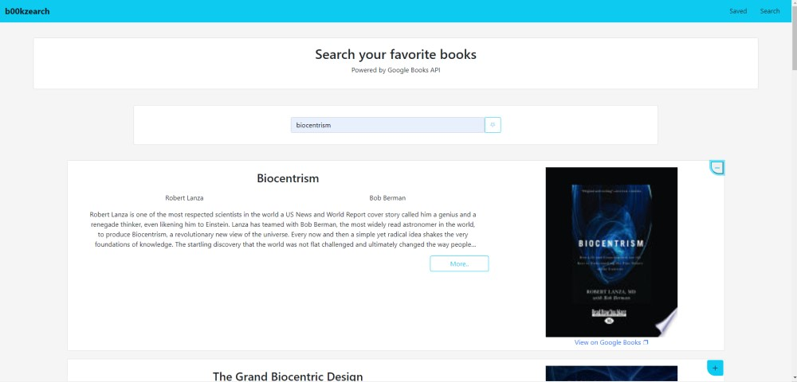
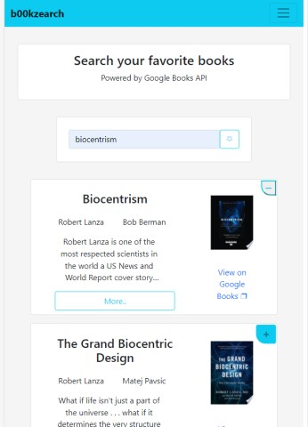

  <h3 align="center">b00kzearch</h3>

            

<!-- TABLE OF CONTENTS -->

  
Table of Contents

  <ol>
    <li>
      <a href="#about-the-project">About The Project</a>
      <ul>
        <li><a href="#built-with">Built With</a></li>
      </ul>
    </li>
    <li><a href="#installation">Installation</a></li>
    <li><a href="#usage">Usage</a></li>
    <li><a href="#testing">Testing</a></li>
    <li><a href="#contributing">Contributing</a></li>
    <li><a href="#contact">Contact</a></li>
    <li><a href="#license">License</a></li>
  </ol>

<!-- ABOUT THE PROJECT -->
## About The Project

This is a MERN (MongoDB, Express, React, Node) application that interacts with Google Books API to allow users to search for books and save them so that they can be viewed later.

[The deployed application can be found here.](https://b00kzearch.herokuapp.com)

   

### Built With

<ul>
	<li>MongoDB</li>
	<li>Express.JS</li>
	<li>React</li>
	<li>Node.JS</li>
</ul>

<!-- GETTING STARTED -->
### Installation

The app need not be installed. It can be accessed at it's deployed location [here](https://b00kzearch.herokuapp.com). If you'd like to run a local copy, see the TESTING section of this README.

<!-- USAGE EXAMPLES -->
## Usage

This is the perfect app for anyone looking to create a reading list.

<!-- TESTING -->
## Testing

Clone the repository and then navigate to the directory it is saved to via the terminal. Run the command 'npm install' to install all necessary dependencies. Create a file named '.env' in the root of the directory and set the env to whatever you'd like. Then create a corresponding file named '.env.<YOUR ENVIRONMENT>' and populate it with the necessary environment variables as outlined in '.env.EXAMPLE'. Run the command 'npm run watch' to start the server. Open another terminal window and cd into the 'client' directory. Run 'npm install' once again. After the dependencies have installed, run 'npm start' to start the development server. The browser should open to the app.

<!-- CONTRIBUTING -->
## Contributing

Contributions are what make the open source community such an amazing place to be learn, inspire, and create. Any contributions you make are **greatly appreciated**.

1. Fork the Project
2. Create your Feature Branch (`git checkout -b feature/AmazingFeature`)
3. Commit your Changes (`git commit -m 'Add some AmazingFeature'`)
4. Push to the Branch (`git push origin feature/AmazingFeature`)
5. Open a Pull Request

<!-- CONTACT -->
## Contact

Brendan Francis - [B.Francis@SprengerV.com](email:B.Francis@SprengerV.com)

Project Link: [https://github.com/SprengerV/b00kzearch](https://github.com/SprengerV/b00kzearch)

<!-- LICENSE -->
## License

BSD 3-Clause License

Copyright (c) 2021, Brendan Francis
All rights reserved.

Redistribution and use in source and binary forms, with or without
modification, are permitted provided that the following conditions are met:

1. Redistributions of source code must retain the above copyright notice, this
   list of conditions and the following disclaimer.

2. Redistributions in binary form must reproduce the above copyright notice,
   this list of conditions and the following disclaimer in the documentation
   and/or other materials provided with the distribution.

3. Neither the name of the copyright holder nor the names of its
   contributors may be used to endorse or promote products derived from
   this software without specific prior written permission.

THIS SOFTWARE IS PROVIDED BY THE COPYRIGHT HOLDERS AND CONTRIBUTORS "AS IS"
AND ANY EXPRESS OR IMPLIED WARRANTIES, INCLUDING, BUT NOT LIMITED TO, THE
IMPLIED WARRANTIES OF MERCHANTABILITY AND FITNESS FOR A PARTICULAR PURPOSE ARE
DISCLAIMED. IN NO EVENT SHALL THE COPYRIGHT HOLDER OR CONTRIBUTORS BE LIABLE
FOR ANY DIRECT, INDIRECT, INCIDENTAL, SPECIAL, EXEMPLARY, OR CONSEQUENTIAL
DAMAGES (INCLUDING, BUT NOT LIMITED TO, PROCUREMENT OF SUBSTITUTE GOODS OR
SERVICES; LOSS OF USE, DATA, OR PROFITS; OR BUSINESS INTERRUPTION) HOWEVER
CAUSED AND ON ANY THEORY OF LIABILITY, WHETHER IN CONTRACT, STRICT LIABILITY,
OR TORT (INCLUDING NEGLIGENCE OR OTHERWISE) ARISING IN ANY WAY OUT OF THE USE
OF THIS SOFTWARE, EVEN IF ADVISED OF THE POSSIBILITY OF SUCH DAMAGE.
© 2021 GitHub, Inc.
                
